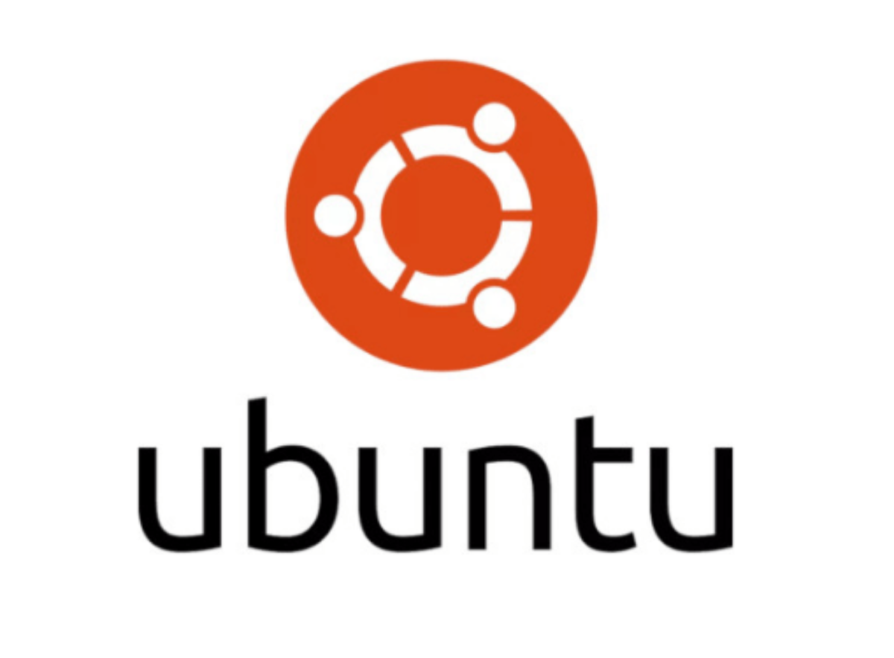
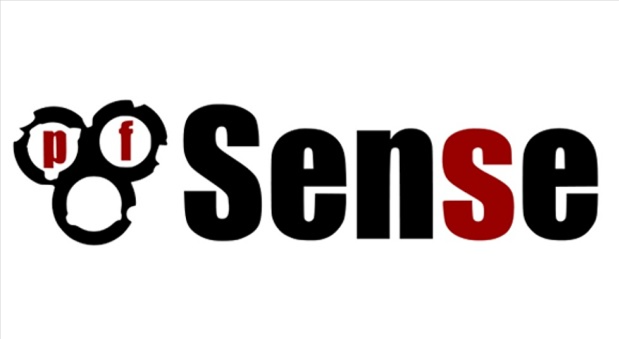

# Documentação do projeto rede 
Nesse repositório está a documentação do projeto final de rede do curso técnico de informática Senac, projeto produzindo por Isack, João Victor, Juliano, Nicolas e Lucas.

## Resumo do projeto:
 
 Nós decidimos criar um projeto utilizando 2 roteadores Cisco 2911, 2 switches Cisco 2950T e 8 máquinas. As máquinas foram divididas em cada switch, com o primeiro switch conectado ao roteador "Roteador 3" através da porta Gigabit 0/1 e o segundo switch conectado ao roteador "Roteador 4". No primeiro switch, colocamos cerca de 5 máquinas, incluindo um Windows Server 2016 como servidor de domínio, um Ubuntu 18.04 como servidor web, uma ferramenta de compartilhamento de pasta (Samba), acesso remoto (SSH) e proxy (Squid). Além disso, adicionamos a ferramenta PfSense como firewall e gerenciador de rede para garantir segurança. No segundo switch, usamos o mesmo número de usuários e incluímos 2 máquinas com Windows 10, além de outra com Windows Server 2016 para administração. Esse Windows Server está vinculado ao servidor "Pai" do primeiro switch. Usamos o Windows Server como administrador das máquinas usuárias, aplicando configurações de segurança através da ferramenta GPO, como a proibição de acesso ao painel de controle. Além disso, usamos o perfil móvel para compartilhar arquivos entre as máquinas e o compartilhamento de pasta para armazenamento adicional.

---
## Ferramentas utilizadas:
### Ubuntu:
 

    

>Ubuntu é um sistema operacional ou sistema operativo de código aberto, construído a partir do núcleo Linux, baseado no Debian e utiliza GNOME como ambiente de desktop de sua mais recente versão com suporte de longo prazo. O software é uma distribuição Linux produzida pela empresa africana Canonical. Ele é um sistema operacional completo que pode ser instalado em computadores PC e Mac. O sistema é um dos Linux mais populares da atualidade.

### Windows Server 2016:
 

    

 

>O Windows Server é uma plataforma para compilar uma infraestrutura de aplicativos, redes e serviços Web conectados, do grupo de trabalho ao data center. Ele faz a ponte entre os ambientes locais e o Azure, adicionando mais camadas de segurança enquanto ajuda você a modernizar seus aplicativos e sua infraestrutura.

### Pfsense:
 

    

 

>O pfSense é vários pacotes de software livre de terceiros para estender suas funcionalidades, tais como Snort e Suricata para detecção e prevenção de intrusão, OpenBGPD, Squid com cache e proxy reverso com SquidGuard, antivírus com ClamWin, além de vários outros pacotes de monitoramento e estatísticas. Ele é um software com a licença BSD, ou seja você não precisa pagar licenças de uso. Além de ser um software gratuito, seus pacotes adicionais permite que ele seja considerado um UTM (Unified Threat Management, “Central Unificada de Gerenciamento de Ameaças”), já que pode-se realizar com o pfSense muitas das atividades que esperamos de sistemas com esta funcionalidade. Ele também possui relatórios em Gráficos RRD, Modelagem de tráfego e filtragem e usa informações em tempo real. Todos os recursos disponíveis são gerenciados exclusivamente por uma interface Web de fácil interpretação. 